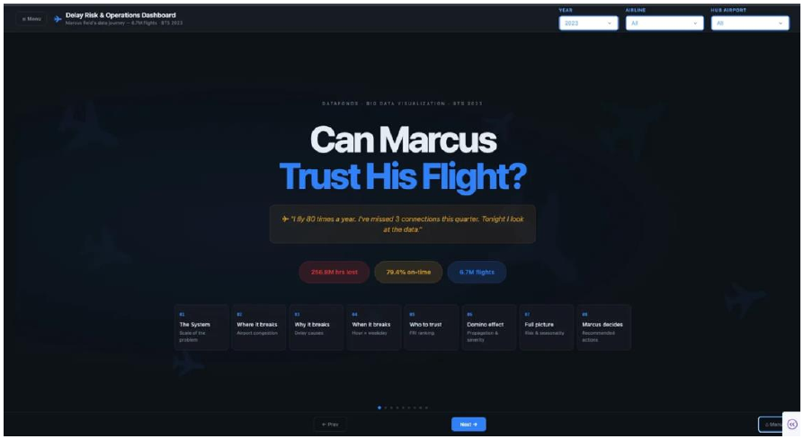
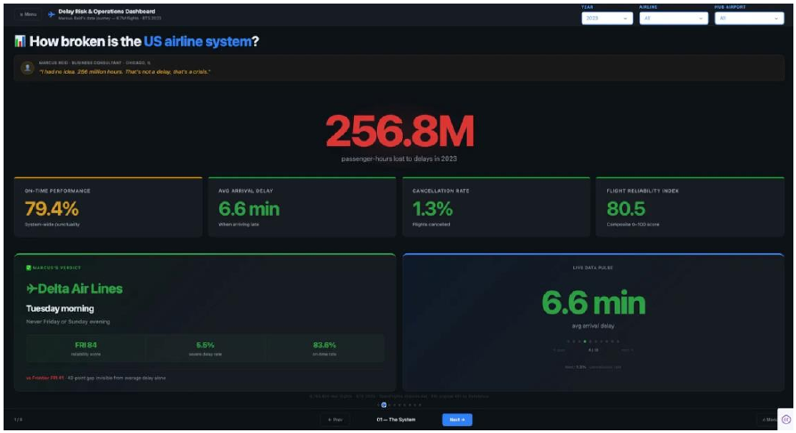

<div align="center">

# ✈️ Can Marcus Trust His Flight?
### US Airline On-Time Performance — Delay Risk & Operations Dashboard

<p>
  
  
  
  
  
</p>

</div>

An interactive analytics dashboard exploring 6.7M+ US domestic flights (BTS On-Time Performance, 2023), built for the **Big Data Visualization** course at Universidad Francisco de Vitoria (UFV). The analysis is framed around a data narrative: **Marcus Reid**, a frequent business flyer, using the numbers to decide which airlines and time slots he can actually trust.

<p align="center">
  
  
</p>

## What it shows

- **The scale of the problem** — 256.8M passenger-hours lost to delays in 2023, 79.4% system-wide on-time performance
- **Where delays hit hardest** — airport-level map with bubble size (flight volume) and color (avg. delay)
- **Why delays happen** — cause breakdown (late aircraft, airline ops, air traffic, weather, security) — 67% is within the airline's control
- **When to avoid flying** — day × hour delay heatmap
- **Which airline to trust** — carrier reliability ranking (Flight Reliability Index, 0–100)

## Tech stack

| Layer | Tools |
|---|---|
| Data pipeline | Python, pandas, requests — downloads BTS monthly data (or falls back to a realistic synthetic dataset if unavailable) |
| Static analysis | matplotlib, seaborn — Grammar of Graphics, colorblind-safe palettes, publication-quality figures |
| Dashboard | Plotly Dash, dash-bootstrap-components — dark theme, KPI cards, interactive filters (year / airline / hub) |

## Project structure

```
├── src/
│   ├── 01_data_pipeline.py          # download + clean BTS data → data/*.parquet
│   ├── 02_static_visualizations.py  # matplotlib/seaborn figures → figures/
│   └── 03_dashboard.py              # Plotly Dash app → localhost:8050
├── data/                            # pre-computed aggregates (bundled — dashboard runs out of the box)
│   ├── agg_airport_stats.parquet
│   ├── agg_carrier_kpi.parquet
│   ├── agg_delay_causes.parquet
│   ├── agg_heatmap.parquet
│   ├── agg_monthly.parquet
│   └── agg_route_stats.parquet
├── demo/
│   └── index.html                   # interactive standalone version of the narrative
├── docs/
│   ├── memo.pdf                     # written analysis memo
│   ├── slide-deck.pdf               # presentation deck
│   └── dashboard-preview.pdf        # dashboard walkthrough (static export)
├── assets/                          # README screenshots
└── requirements.txt
```

The heavy per-flight dataset (`bts_2023_clean.parquet`, ~64MB) isn't tracked in the repo — it's regenerated locally by the pipeline instead of bloating the git history.

## Running it locally

```bash
pip install -r requirements.txt
python src/03_dashboard.py              # launches the dashboard using the bundled aggregates
```

Then open **http://127.0.0.1:8050**.

To rebuild everything from scratch (fresh BTS download + full aggregates + static figures):

```bash
python src/01_data_pipeline.py          # rebuilds data/ (downloads BTS data, or synthesizes it)
python src/02_static_visualizations.py  # optional — regenerates static figures/
```

## Team

Built by **Daniel Guilabert** (Data Lead), **Miguel Mercadé** (Narrative Lead) and **Alberto Rojas** (Viz Lead & dashboard implementation) — Datafonos, Big Data Visualization, UFV.

## Data source

[BTS Reporting Carrier On-Time Performance](https://transtats.bts.gov/DL_SelectFields.asp) — US Bureau of Transportation Statistics, 2023.
